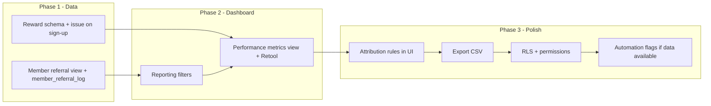

# Lockeroom Referral Program Dashboard – Build Plan (Remaining Work)

**Completed (out of scope):**

- **Section 2 – Referral Lead Table:** Table `lead_referral` and form that capture: Referral Name, Referral Phone Number, Referral Email, Referring Member (linked), Date Referral Submitted, Referral Type (Direct / Indirect / Goodwill Exception), Attribution Notes (free text). Form enters detail into `lead_referral`.
- **Section 3 – Trial & Conversion Tracking:** T1/T2/T3 + dates, Completed All 3 auto-calc, Signed Up, Membership Type/Value, Revenue/Price paid, If Not Signed reason dropdown + notes, CRON/backfill from `member_memberships` and `newsale_meta`.

**In scope below:** Sections 1, 4, 5, 6, Attribution Rules, Integrations, User Access, Automation, and Deliverables.

---

## 1. Master Member Referral Table (Section 1)

**1.1 Member referral view (one row per active member)**

- **Source:** Active members (from `member_database` or existing member source).
- **Fields:**
  - Member ID, Member Full Name
  - Has Referred? (Yes/No)
  - Number of Referrals Made (count from `lead_referral` where `referring_member` = member id)
  - Total Membership Value (from membership/renewal data)
  - Membership Renewal Date, Membership Type
  - Outstanding $ Credit Balance, Total $ Credit Redeemed, Total $ Credit Earned (from reward/credit tables – see Section 4)
  - Date of Last Referral Touchpoint, Type of Last Referral Touchpoint (dropdown: Seasonal Promotion, Renewal, Winning Client Result, Survey Response, 3 Month Revenue Call, 30 Day Call, New Sale Email / Welcome Pack)
  - Staff Member Responsible for Last Touchpoint
- **Implementation:** Supabase view (e.g. `member_referral_view`) joining member table + aggregates from `lead_referral` + reward/credit data. “Last touchpoint” requires a **member_referral_log** (or equivalent) table for history.

**1.2 Member_referral_log (existing member activity / touchpoint history)**

- **Purpose:** Store each referral-related touchpoint per member so “last touchpoint” and reporting are derivable.
- **Suggested fields:** `id`, `member_id` (FK), `touchpoint_type` (enum or FK to types above), `touchpoint_date`, `staff_member_id` or `staff_member_name`, `created_at`, optional `notes`.
- **Implementation:** New table + RLS (if needed). View in 1.1 uses this (e.g. latest row per `member_id`) for “Date of Last Referral Touchpoint”, “Type of Last Referral Touchpoint”, “Staff Member Responsible”.

**Deliverable:** Migration(s) for view + `member_referral_log` (or equivalent), and Retool resources that read from them.

---

## 2. Reward Management (Section 4)

- **Concept:** $1,000 credit per successful referral; track issued/redeemed/outstanding per member.
- **Doc requirements:**
  - $1,000 Credit Issued? (Y/N) – store in `member_holds` (or equivalent) with a specialty tag.
  - Date Credit Issued (align with `date_created` in hold record).
  - Applied to Renewal? (Y/N), Date Applied.
  - Any Manual Override Notes.
  - Link credit to referring member; auto-calculate “credit earned” when Signed Up = Yes.
- **Implementation:**
  - **Option A:** Use existing `member_holds` (or similar) table: add a “referral credit” type/tag and columns if needed (e.g. `applied_to_renewal`, `date_applied`, `notes`). One row per $1k credit issued.
  - **Option B:** New table e.g. `referral_credit` with `member_id`, `lead_referral_id`, `amount`, `issued_at`, `applied_to_renewal`, `date_applied`, `notes`, `created_at`.
  - Trigger or CRON: when a lead is marked Signed Up (or when `member_memberships` backfill sets it), create or flag a referral credit for the `referring_member` (and optionally link to `lead_referral.id`).
- **Views/aggregates:** Outstanding balance, total issued, total redeemed (if redemption is tracked in the same or related table) for use in Section 1 view and Section 6 dashboard.

**Deliverable:** Schema (migration) for referral credits, logic to issue on sign-up, and Retool (or dashboard) fields for credit issued/redeemed/outstanding.

---

## 3. Reporting & Filtering (Section 5)

- **Scope:** Filtering of `lead_referral` (and any related views) in the dashboard.
- **Required filters (from doc):**
  - Sessions completed (e.g. T1/T2/T3 or “Completed All 3”)
  - Revenue Generated (e.g. price paid range or min)
  - Membership Type
  - Referral Type (Direct / Indirect / Goodwill)
  - Staff Member (if captured on leads or touchpoints)
  - Referring Member
  - Date Range (e.g. date_created or conversion date)
  - Converted vs not converted (Signed Up = Yes/No)
- **Implementation:** Retool (or other UI) filter controls that map to Supabase query params or a filtered view. Ensure underlying tables/views expose these dimensions (e.g. `referral_type`, `signed_up`, `membership`, `price_paid`, `referring_member`, dates).

**Deliverable:** All filters implemented in Referral Conversion Dashboard (or equivalent) with correct mapping to `lead_referral` and related data.

---

## 4. Performance Dashboard View (Section 6)

- **Metrics (from doc):**
  - Total Referrals YTD
  - Total Referrals This Month
  - Conversion Rate (%)
  - Total Revenue Generated (from converted referrals)
  - Total Credits Issued
  - Outstanding Credit Liability
  - Referral Rate Per 100 Members
  - Top Referring Members
  - Referrals by Touchpoint Source
- **Implementation:** Supabase views or SQL queries that compute these from `lead_referral`, `member_referral_view`, `member_referral_log`, and reward/credit tables. Retool dashboard with components that call these queries and update dynamically (no hardcoding dates where possible – use “this month”, “YTD”).

**Deliverable:** One or more Retool app(s) or views showing the above metrics with correct definitions and dynamic date ranges.

---

## 5. Attribution Rules (Section 7)

- **Direct:** Verifiable referral conversation; name quoted in enquiry; referrer mentioned before enquiry; referrer provided details.
- **Indirect:** No prior notification; referral influenced but came through ad.
- **Goodwill:** Tracked separately; honour for relationship reasons.
- **Implementation:** Section 2 form already captures `referral_type` (Direct/Indirect/Goodwill). Add brief guidance or tooltips in the form and in reports so staff can classify correctly. No new tables required.

**Deliverable:** Enum/options in DB and Retool, plus short in-app guidance for when to use each type.

---

## 6. Integrations (Section 8)

- **Export (CSV):** Add export from Retool (or Supabase) for `lead_referral` and key views (e.g. member referral view, performance metrics) with applied filters.
- **Manual entry fallback:** Already partially covered by Referral Tracking Form; document any edge cases that require manual correction (e.g. backfill).
- **HubSpot / Wellness Living:** Confirm feasibility (APIs, auth, rate limits). Propose phased approach: Phase 1 – manual entry + export; Phase 2 – sync or import from HubSpot/Wellness Living if scope and constraints are agreed.

**Deliverable:** CSV export; short integration feasibility note and phased proposal for HubSpot/Wellness Living.

---

## 7. User Access & Permissions (Section 9)

- **Roles from doc:** Read-only executive; Revenue Team (touchpoints + member tracking); Sales Team (referral lead + trial + conversion); Admin (full).
- **Implementation:** Prefer Supabase RLS + role-based policies on `lead_referral`, `member_referral_log`, referral credit table, and views. Retool: map user/role to Supabase role or use Retool’s access controls so each role only sees allowed apps/pages and actions (e.g. Sales can edit leads, Revenue can edit touchpoints, Admin can do both + config).

**Deliverable:** RLS policies (and any migration) plus Retool permission matrix documented and applied.

---

## 8. Automation (Section 10)

- **Already in scope elsewhere:** Auto-calculate reward credit when Signed Up = Yes (Section 4); conversion rate from data (Section 6).
- **Additional from doc:** Auto-flag when revenue call score = 8–10 or survey score = 8–10. Requires: (1) source of “revenue call score” and “survey score” (e.g. HubSpot, Wellness Living, or manual table); (2) a “flag” (e.g. column or notification). If source is not yet in Supabase, add as Phase 2 and document.

**Deliverable:** Document where scores will live and how “auto-flag” will work; implement if data source is available in Phase 1.

---

## 9. Deliverables (Section 11)

- Training walkthrough for staff (short doc or video: how to use form, dashboard, filters, attribution).
- Beta version for internal testing, then final live version.
- Timeline for development (from this plan).
- Confirmation of data architecture (one-page diagram: tables, views, key relationships).
- Wireframe overview before build – if not already done, lightweight wireframes for dashboard and form flows.

---

## Suggested build order

1. **Phase 1 – Data:** Section 1 (view + log), Section 4 (reward table + auto-issue).
2. **Phase 2 – Dashboard:** Section 5 (filters), Section 6 (performance view + Retool).
3. **Phase 3 – Polish:** Attribution guidance in UI, CSV export, RLS/permissions, automation flags, deliverables (training, architecture doc, wireframes if needed).

---

## Dependencies and notes

- **member_database / member_memberships / newsale_meta:** Section 3 already uses these for CRON/backfill; Section 1 and 4 will depend on the same sources for member list, membership value, and renewal dates.
- **member_holds (or equivalent):** Confirm table name and schema before implementing Section 4; if none exists, use a dedicated `referral_credit` (or similar) table.
- **Retool:** Both [Referral Conversion Dashboard](https://lockeroomgym.retool.com/embedded/public/c8c69ff6-42da-4904-942f-c66f1a1fd366) and [Referral Tracking Form](https://lockeroomgym.retool.com/embedded/public/eb08c48d-2553-4182-8955-2c17a780e92f) are existing; extend them for new views, filters, and metrics rather than replacing.

This plan covers the remainder of the [Project Brief](https://docs.google.com/document/d/1FL0q0SmGcwlCZESExiDaVrszS_RXMiirpYw8KtZ8lBA/edit?usp=sharing) with Sections 2 (Referral Lead Table & Form) and 3 (Trial & Conversion Tracking) excluded as completed.