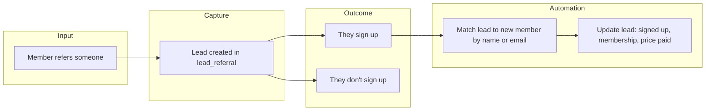

# How referral tracking works (simple view)

A short, non-technical overview of how leads and sign-ups are tracked.

---

## The flow in words

1. **Someone is referred**  
   A member refers a friend. We create a **lead** record with their name, email, who referred them, and how far they get (e.g. T1, T2, T3, or “all completed”).

2. **We track the lead**  
   The lead lives in our system with: name, email, phone, referrer, trial steps, and whether they’ve signed up yet.

3. **If they sign up**  
   When they become a member and get a **primary membership**, we match them to that lead (by name or email) and automatically mark the lead as “signed up” and fill in which membership they chose and what they paid.

4. **If they don’t sign up**  
   We can record why (e.g. price, timing, not ready, went elsewhere) in the lead record.

---

## Simple diagram

```
  [Member refers someone]
            │
            ▼
  ┌─────────────────────┐
  │  Lead created       │  ← Name, email, phone, who referred them,
  │  (lead_referral)    │     trial steps (T1, T2, T3)
  └──────────┬──────────┘
             │
             ├──────────────────────────────────┐
             │                                  │
             ▼                                  ▼
  ┌─────────────────────┐            ┌─────────────────────┐
  │  They sign up       │            │  They don’t sign up │
  │  (primary           │            │  (reason recorded:  │
  │   membership        │            │   price, timing,    │
  │   created)          │            │   went elsewhere…)  │
  └──────────┬──────────┘            └─────────────────────┘
             │
             ▼
  ┌─────────────────────┐
  │  System matches     │  ← Same person? (name or email)
  │  lead ↔ member      │
  └──────────┬──────────┘
             │
             ▼
  ┌─────────────────────┐
  │  Lead updated:      │  ← “Signed up” = yes,
  │  signed up,         │     membership name, value, price paid
  │  membership chosen, │
  │  price paid         │
  └─────────────────────┘
```

---

## Mermaid diagram (for docs that render it)



---

See **BUILD_LOG.md** for the full list of what’s been built (tables, columns, migrations).
