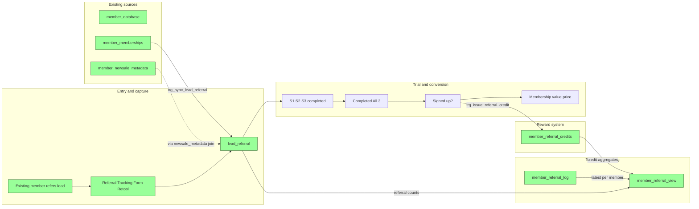
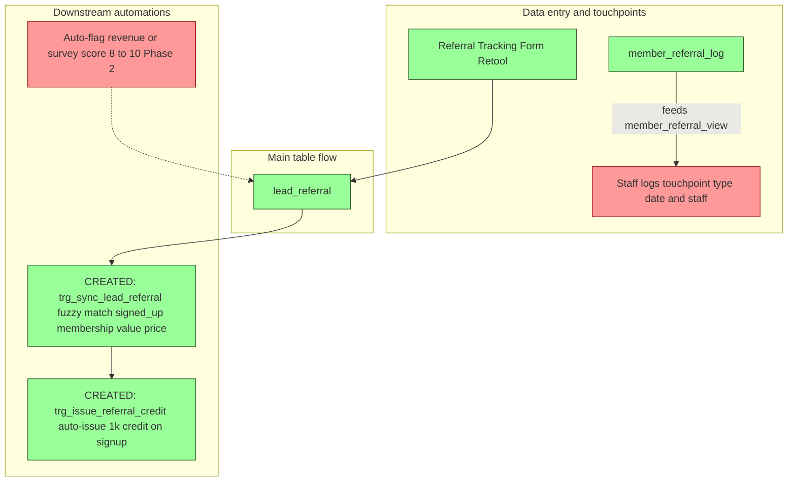
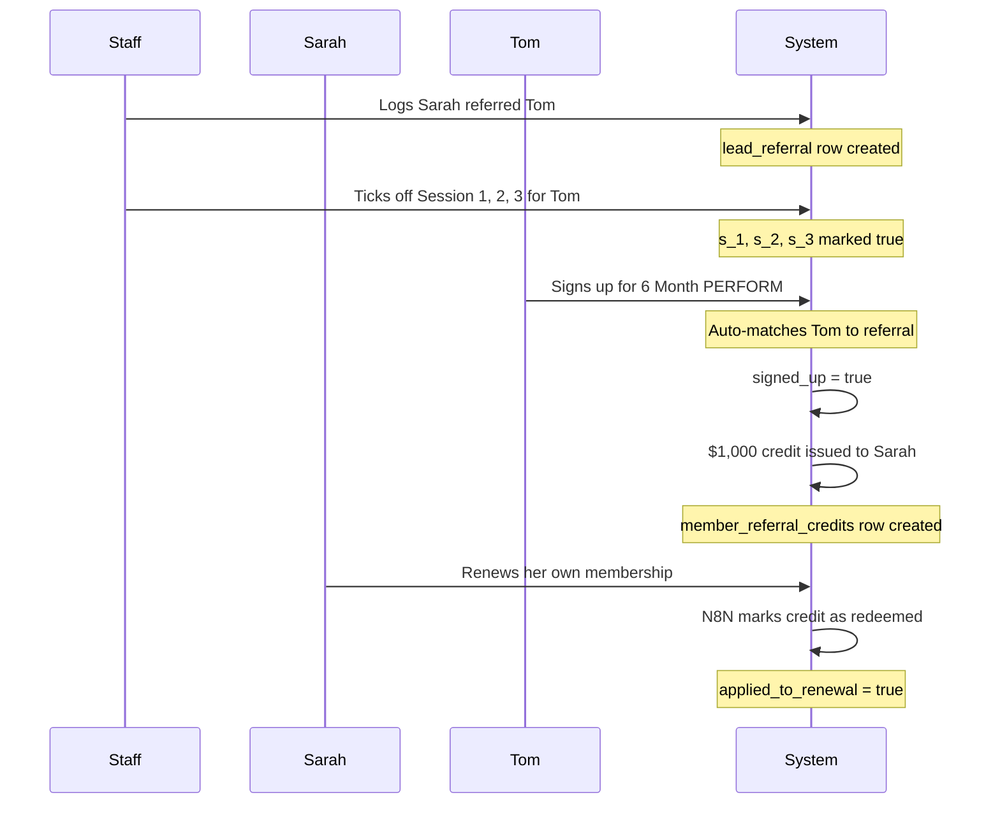

# Referral Dashboard – Dataflow & Progress

This document reflects the current state of Supabase for the Lockeroom Referral Program (from the [Referral Dashboard Build Plan](.cursor/plans/referral_dashboard_build_plan_fa12ee9d.plan.md)).  
**Green** = created in Supabase. **Red** = not yet created.

---

## Summary: Created vs not created

| Type | Created (green) | Not created (red) |
|------|------------------|-------------------|
| **Tables** | `lead_referral`, `member_referral_log`, `member_referral_credits` | — |
| **Views** | `member_referral_view` | — |
| **Enums** | `referral_touchpoint_type` (7 values) | — |
| **Functions** | `sync_lead_referral_on_new_membership()`, `issue_referral_credit_on_signup()` | — |
| **Triggers** | `trg_sync_lead_referral_on_membership_insert`, `trg_issue_referral_credit_on_signup` | — |
| **Automation** | Retool Referral Tracking Form (writes to lead_referral) | — |

---

## Dataflow diagrams

All referral dataflow diagrams are in this section: (1) left-to-right timeline, (2) automations above/below the main flow.

### 1. Left to right timeline

Flow is **left to right**: from "existing member refers a lead" through to "lead in `lead_referral`", trial/conversion, and reward credit.

---

### 2. Automations and triggers (above/below flow)

---

## How it works — walkthrough with example

> Meet **Sarah** (existing Lockeroom member) and **Tom** (her friend). This walks through what happens at every stage, from referral to credit redemption.

### Stage 1 — Referral logged

Sarah tells the team that her friend Tom wants to try Lockeroom. A staff member opens the **Referral Tracking Form** in Retool and enters Tom's name, phone, and email, selecting Sarah as the referring member.

*Technical: A new row is inserted into `lead_referral` with Tom's details and `referring_member` set to Sarah's `member_database.id`.*

### Stage 2 — Trial sessions

Tom comes in for his three trial sessions over the next couple of weeks. After each session, a staff member ticks off Session 1, Session 2, then Session 3 in Retool.

*Technical: `s_1`, `s_2`, `s_3` are set to `true` on Tom's `lead_referral` row. Retool's transformer calculates `all_completed = true` when all three are done.*

### Stage 3 — Signup confirmed and credit issued

Tom decides to sign up for a **6 Month PERFORM x3** membership. The team processes the sale and a new membership record is created. Two things happen automatically:

1. The system recognises Tom's name matches the referral and marks it as **signed up**, pulling in the membership value and price paid.
2. Because the referral is now confirmed, a **$1,000 credit** is automatically created for Sarah.

*Technical: Inserting into `member_memberships` fires `trg_sync_lead_referral` which fuzzy-matches Tom's name to `lead_referral.name`, then sets `signed_up = true`, `membership` (FK), `membership_value`, and `price_paid`. That update fires `trg_issue_referral_credit` which inserts a row in `member_referral_credits` with `member_id` = Sarah, `lead_referral_id` = Tom's referral, `membership_id` = Tom's new membership, `amount` = 1000.*

### Stage 4 — Renewal redeems credit

Six months later, Sarah renews her own membership. The N8N automation detects the renewal and automatically marks all of Sarah's outstanding referral credits as **redeemed**.

*Technical: N8N detects a new row in `member_memberships` where `membership_stage = 'renewal'` for Sarah's `member_id`. It runs an UPDATE on `member_referral_credits` setting `applied_to_renewal = true` and `date_applied = CURRENT_DATE` for all of Sarah's unredeemed rows.*

### What Sarah's dashboard row looks like after each stage

| Stage | has_referred | referral_count | credit_earned | credit_redeemed | outstanding |
|-------|-------------|---------------|---------------|----------------|-------------|
| After Stage 1 | true | 0 | $0 | $0 | $0 |
| After Stage 3 | true | 1 | $1,000 | $0 | $1,000 |
| After Stage 4 | true | 1 | $1,000 | $1,000 | $0 |

> **Note:** `referral_count` only increments when the referred lead actually signs up (Stage 3), not when the referral is first logged. If Tom never signed up, Sarah would still show `has_referred = true` but `referral_count = 0` and no credit.

---

## Completed: Supabase functions and triggers

### ~~Part 1: Match new member_memberships to lead_referral and auto-fill conversion~~ DONE

**Status:** All applied. FK constraint, function (`sync_lead_referral_on_new_membership()`), and trigger (`trg_sync_lead_referral_on_membership_insert`) are live.

### ~~Part 2: Reward management — referral credit system~~ DONE

**Status:** All applied:
- **Enum:** `referral_touchpoint_type` with 7 values (seasonal_promotion, renewal, winning_client_result, survey_response, 3_month_revenue_call, 30_day_call, new_sale_email_welcome_pack).
- **Table:** `member_referral_log` — touchpoint history per member (member_id FK, touchpoint_type enum, touchpoint_date, staff_member_id FK, notes).
- **Table:** `member_referral_credits` — $1k credit per successful referral (member_id FK, lead_referral_id FK, membership_id FK to member_memberships, amount default 1000, issued_at, applied_to_renewal, date_applied, notes).
- **Function:** `issue_referral_credit_on_signup()` — AFTER UPDATE on `lead_referral`, when `signed_up` changes to true and `referring_member` is set, auto-inserts a $1k credit row in `member_referral_credits` with membership_id linking to the referred lead's membership (with duplicate guard).
- **Trigger:** `trg_issue_referral_credit_on_signup` — fires the above function.
- **View:** `member_referral_view` — one row per member from `member_database`, with: has_referred, referral_count, total_credit_earned, total_credit_redeemed, outstanding_credit, last_touchpoint_date, last_touchpoint_type, last_touchpoint_staff_id.

---

## Tables and views reference

| Object | Status | Notes |
|--------|--------|--------|
| **lead_referral** | ✅ Created | Referral name, phone, email, referring_member, date_created, referral_type, attribution_notes; s_1/s_2/s_3 (Session 1–3), all_completed, signed_up, membership (FK to member_memberships), membership_value, price_paid, reason_nosignup, sale_objection_reason. |
| **member_referral_log** | ✅ Created | Touchpoint history: member_id (FK), touchpoint_type (enum), touchpoint_date, staff_member_id (FK), notes, created_at. |
| **member_referral_credits** | ✅ Created | Referral credits: member_id (FK), lead_referral_id (FK), membership_id (FK to member_memberships — the referred lead's membership), amount (default 1000), issued_at, applied_to_renewal, date_applied, notes, created_at. |
| **member_referral_view** | ✅ Created | One row per member: has_referred, referral_count, total_credit_earned, total_credit_redeemed, outstanding_credit, last_touchpoint_date/type/staff. |
| **member_database** | ✅ Exists | Source for active members and member list. |
| **member_memberships** | ✅ Exists | Source for renewal/sign-up and backfill. |
| **member_newsale_metadata** / **member_renewal_meta** | ✅ Exist | Source for new sale/renewal and backfill. |

---

## Functions and triggers

- **`sync_lead_referral_on_new_membership()`** — AFTER INSERT on `member_memberships`. Fuzzy-matches new member name (via `member_database` join) to `lead_referral.name`. Updates `membership` (FK), `membership_value`, `price_paid`, `signed_up = true`.
- **`trg_sync_lead_referral_on_membership_insert`** — trigger that calls the above.
- **`issue_referral_credit_on_signup()`** — AFTER UPDATE on `lead_referral`. When `signed_up` flips to true and `referring_member` is set, inserts a $1k row into `member_referral_credits` with `membership_id` set to the referred lead's membership FK (skips if already exists for that lead).
- **`trg_issue_referral_credit_on_signup`** — trigger that calls the above.
- **FK constraints:** `lead_referral.membership` → `member_memberships.id`; `member_referral_credits.member_id` → `member_database.id`; `member_referral_credits.lead_referral_id` → `lead_referral.id`; `member_referral_credits.membership_id` → `member_memberships.id`; `member_referral_log.member_id` → `member_database.id`; `member_referral_log.staff_member_id` → `staff_database.id`.

---

*Last updated: March 2026. All referral system tables, views, functions, and triggers are live in Supabase.*
