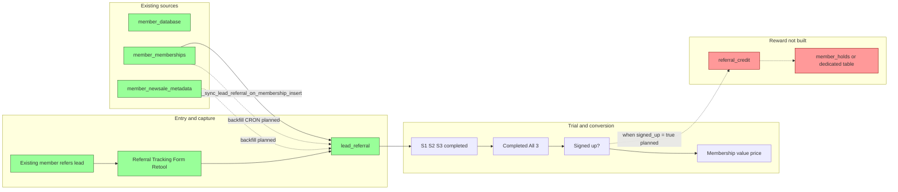
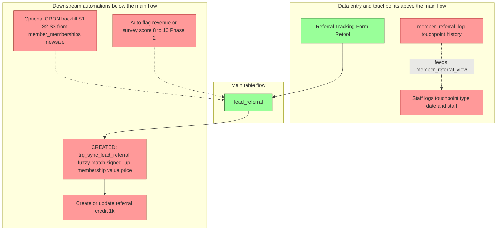

# Referral Dashboard – Dataflow & Progress

This document reflects the current state of Supabase for the Lockeroom Referral Program (from the [Referral Dashboard Build Plan](.cursor/plans/referral_dashboard_build_plan_fa12ee9d.plan.md)).  
**Green** = created in Supabase. **Red** = not yet created. Conversion automations will be implemented in Supabase (see Plan below).

---

## Summary: Created vs not created

| Type | Created (green) | Not created (red) |
|------|------------------|-------------------|
| **Tables** | `lead_referral` | `member_referral_log`, `referral_credit` (or referral type on `member_holds`) |
| **Views** | — | `member_referral_view` |
| **Functions** | `sync_lead_referral_on_new_membership()` | Referral-credit function (see Plan Part 2) |
| **Triggers** | `trg_sync_lead_referral_on_membership_insert` (AFTER INSERT on member_memberships) | Trigger on lead_referral for all_completed when S1+S2+S3 = true |
| **Cron** | — | No referral-specific cron in Supabase |
| **RLS** | — | RLS not enabled on lead_referral; no policies yet |
| **Automation** | Retool Referral Tracking Form (writes to lead_referral) | Conversion automations in Supabase (see Plan); $1k credit; auto-flag score 8–10 |

---

## Dataflow diagrams

All referral dataflow diagrams are in this section: (1) left-to-right timeline, (2) automations above/below the main flow.

### 1. Left to right timeline

Flow is **left to right**: from “existing member refers a lead” through to “lead in `lead_referral`”, trial/conversion, and (future) credit.  
Automations/triggers sit **above** (data entry / touchpoints) and **below** (downstream actions).

---

### 2. Automations and triggers (above/below flow)

---

## Plan: Supabase functions and triggers (to build)

These automations are **not** in Retool; they will be implemented in Supabase.

### Part 1: Match new member_memberships to lead_referral and auto-fill conversion

**Goal:** When a new row is inserted into `member_memberships`, if the member’s name fuzzy-matches a lead in `lead_referral`, automatically update that lead with the new membership and set signed up.

**Steps:**

1. **Schema**
   - Ensure `lead_referral.membership` is a **foreign key to `member_memberships.id`** (it is already `uuid`; add FK constraint if missing).
   - No change to `member_database` for this; we use `member_memberships.member_name` (or join to `member_database` for the name) for matching.

2. **Function**
   - Create a function, e.g. `sync_lead_referral_on_new_membership()`, that:
     - Runs in a trigger context **AFTER INSERT** on `member_memberships` (and optionally AFTER UPDATE when `newsale_metadata` is set).
     - Takes the new row: `NEW.member_name` (or name from `member_database` via `NEW.member_id`), `NEW.id` (membership id), `NEW.newsale_metadata` (uuid → `member_newsale_metadata`).
     - **Fuzzy-matches** `NEW.member_name` (or member_database full name) to `lead_referral.name` (e.g. using `similarity()` from pg_trgm, or `word_similarity`, and a threshold).
     - If exactly one matching lead is found (or best match above threshold):
       - Update that `lead_referral` row:
         - `membership` = `NEW.id` (the new `member_memberships.id`).
         - `membership_value` = `base_membership_value` from `member_newsale_metadata` where `id = NEW.newsale_metadata`.
         - `price_paid` = `price_paid` from `member_newsale_metadata` where `id = NEW.newsale_metadata`.
         - `signed_up` = `true`.
     - If `NEW.newsale_metadata` is null, membership_value and price_paid can be left unchanged or set to null.

3. **Trigger**
   - Create trigger on `member_memberships`: **AFTER INSERT** (and optionally AFTER UPDATE of `newsale_metadata`), call `sync_lead_referral_on_new_membership()`.

**Data sources:**

| lead_referral column | Source |
|----------------------|--------|
| `membership`         | `member_memberships.id` (new row) |
| `membership_value`   | `member_newsale_metadata.base_membership_value` via `member_memberships.newsale_metadata` |
| `price_paid`         | `member_newsale_metadata.price_paid` via `member_memberships.newsale_metadata` |
| `signed_up`          | Set to `true` |

**Fuzzy match:** Use the new membership’s member name (`member_memberships.member_name` or `member_database` joined by `member_id`) against `lead_referral.name`. Postgres `pg_trgm` extension provides `similarity()` / `word_similarity()`; set a threshold (e.g. > 0.3) and pick best match, or require single match.

---

### Part 2 (later)

- **all_completed:** Trigger or function so that when `s_1`, `s_2`, and `s_3` are all true on a `lead_referral` row, set `all_completed = true` (and optionally when any is false, set `all_completed = false`). Can be a small trigger on `lead_referral` BEFORE INSERT/UPDATE.
- **Referral credit:** When a lead is marked signed up, create/update a row in `referral_credit` (or `member_holds` with referral type) for the `referring_member` ($1k credit). Separate trigger or same function.

---

## Tables and views reference

| Object | Status | Notes |
|--------|--------|--------|
| **lead_referral** | ✅ Created | Referral name, phone, email, referring_member, date_created, referral_type, attribution_notes; s_1/s_2/s_3 (Session 1–3), all_completed, signed_up, membership, membership_value, price_paid, reason_nosignup, sale_objection_reason. |
| **member_referral_view** | ❌ Not created | Planned view: one row per active member, has_referred, referral count, membership value, renewal date, credit balances, last touchpoint date/type/staff. |
| **member_referral_log** | ❌ Not created | Planned table: touchpoint history (member_id, touchpoint_type, touchpoint_date, staff_member_id, notes). |
| **referral_credit** (or member_holds extension) | ❌ Not created | $1k credit per successful referral; issued/redeemed/outstanding; trigger when signed_up = true. |
| **member_database** | ✅ Exists | Source for active members and member list. |
| **member_memberships** | ✅ Exists | Source for renewal/sign-up and backfill. |
| **member_newsale_metadata** / **member_renewal_meta** | ✅ Exist | Source for new sale/renewal and backfill. |
| **member_holds** | ✅ Exists | No referral-specific column yet; plan Option A is to add referral type/tag here, or use new **referral_credit** table. |

---

## Functions and triggers

- **Supabase (current):** No referral-specific functions or triggers. No routines reference `lead_referral`; no triggers on `lead_referral` or `member_memberships` for referral sync.
- **Planned (see “Plan” above):**
  - **Part 1:** Trigger on `member_memberships` INSERT (and optionally UPDATE): fuzzy match new member name to `lead_referral.name` → update that lead’s `membership` (FK to `member_memberships.id`), `membership_value` and `price_paid` from `member_newsale_metadata`, and `signed_up = true`.
  - **Part 2:** Trigger on `lead_referral` so `all_completed` is set when S1, S2, S3 are all true; and trigger/function to create referral credit when signed up.

---

## Cron jobs

- **Referral-related cron:** None. Existing cron jobs cover coach expectations, schedule periods, snapshots, attendance views, etc.
- **Planned:** CRON/backfill from `member_memberships` and newsale meta into `lead_referral` for S1/S2/S3 and conversion (if not done entirely in Retool).

---

*Last aligned with build plan: Sections 1–11; Sections 2 (Lead Table & Form) and 3 (Trial & Conversion Tracking) treated as completed in scope.*
