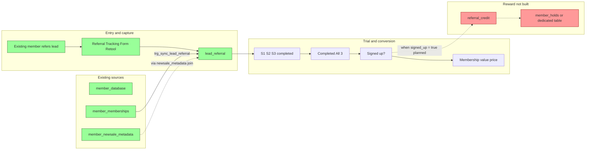
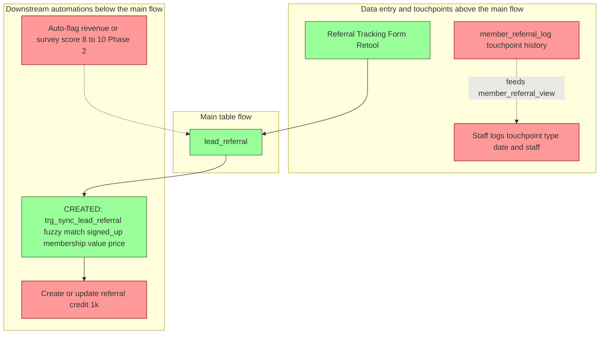

# Referral Dashboard – Dataflow & Progress

This document reflects the current state of Supabase for the Lockeroom Referral Program (from the [Referral Dashboard Build Plan](.cursor/plans/referral_dashboard_build_plan_fa12ee9d.plan.md)).  
**Green** = created in Supabase. **Red** = not yet created.

---

## Summary: Created vs not created

| Type | Created (green) | Not created (red) |
|------|------------------|-------------------|
| **Tables** | `lead_referral` | — |
| **Views** | — | `member_referral_view` |
| **Functions** | `sync_lead_referral_on_new_membership()` | — |
| **Triggers** | `trg_sync_lead_referral_on_membership_insert` (AFTER INSERT on member_memberships) | — |
| **Automation** | Retool Referral Tracking Form (writes to lead_referral) | — |

### Next to build

1. **Referral Credit System** — schema, trigger logic, and tracking for $1k credit per successful referral (issued/redeemed/outstanding per member).
2. **Member Referral Log and Touchpoint History** — table and view for tracking referral-related touchpoints per member (type, date, staff, notes) and the `member_referral_view` aggregate.

---

## Dataflow diagrams

All referral dataflow diagrams are in this section: (1) left-to-right timeline, (2) automations above/below the main flow.

### 1. Left to right timeline

Flow is **left to right**: from "existing member refers a lead" through to "lead in `lead_referral`", trial/conversion, and (future) credit.  
Automations/triggers sit **above** (data entry / touchpoints) and **below** (downstream actions).

---

### 2. Automations and triggers (above/below flow)

---

## Plan: Supabase functions and triggers (to build)

These automations are implemented in Supabase.

### ~~Part 1: Match new member_memberships to lead_referral and auto-fill conversion~~ DONE

~~**Goal:** When a new row is inserted into `member_memberships`, if the member's name fuzzy-matches a lead in `lead_referral`, automatically update that lead with the new membership and set signed up.~~

~~**Steps:**~~

~~1. **Schema** — `lead_referral.membership` FK to `member_memberships.id`.~~
~~2. **Function** — `sync_lead_referral_on_new_membership()`: AFTER INSERT on `member_memberships`, join to `member_database` for full name, fuzzy-match to `lead_referral.name` (ILIKE contains + `word_similarity()` pg_trgm > 0.4), update `membership`, `membership_value`, `price_paid`, `signed_up = true`.~~
~~3. **Trigger** — `trg_sync_lead_referral_on_membership_insert` AFTER INSERT on `member_memberships`.~~

**Status:** All applied. FK constraint, function, and trigger are live in Supabase.

---

## Tables and views reference

| Object | Status | Notes |
|--------|--------|--------|
| **lead_referral** | ✅ Created | Referral name, phone, email, referring_member, date_created, referral_type, attribution_notes; s_1/s_2/s_3 (Session 1–3), all_completed, signed_up, membership (FK to member_memberships), membership_value, price_paid, reason_nosignup, sale_objection_reason. |
| **member_referral_view** | ❌ Not created | Planned view: one row per active member, has_referred, referral count, membership value, renewal date, credit balances, last touchpoint date/type/staff. |
| **member_referral_log** | ❌ Not created | Planned table: touchpoint history (member_id, touchpoint_type, touchpoint_date, staff_member_id, notes). |
| **referral_credit** (or member_holds extension) | ❌ Not created | $1k credit per successful referral; issued/redeemed/outstanding; trigger when signed_up = true. |
| **member_database** | ✅ Exists | Source for active members and member list. |
| **member_memberships** | ✅ Exists | Source for renewal/sign-up and backfill. |
| **member_newsale_metadata** / **member_renewal_meta** | ✅ Exist | Source for new sale/renewal and backfill. |
| **member_holds** | ✅ Exists | No referral-specific column yet; plan Option A is to add referral type/tag here, or use new **referral_credit** table. |

---

## Functions and triggers

- **Supabase (created):**
  - **`sync_lead_referral_on_new_membership()`** — trigger function on `member_memberships` AFTER INSERT. Joins `member_memberships.member_id` → `member_database` to get the full name (`member_name`, `first_name`, `last_name`). Uses contains-style ILIKE and `word_similarity()` (pg_trgm, threshold > 0.4) to fuzzy-match against `lead_referral.name`. If a matching lead is found (not already signed up): sets `membership` (FK to `member_memberships.id`), `membership_value` and `price_paid` from `member_newsale_metadata` (via `member_memberships.newsale_metadata`), and `signed_up = true`.
  - **Trigger:** `trg_sync_lead_referral_on_membership_insert` — AFTER INSERT on `member_memberships`, calls the above function.
  - **FK constraint:** `lead_referral.membership` → `member_memberships.id` (added as `lead_referral_membership_fkey`).
- **Planned:**
  - Referral credit system (function/trigger to create credit when signed_up becomes true).

---

*Last aligned with build plan: Sections 1–11; Sections 2 (Lead Table & Form) and 3 (Trial & Conversion Tracking) treated as completed in scope.*
